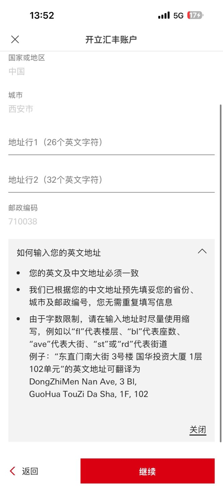

<a id="hsbc-index"></a>
# 香港汇丰银行 (HSBC HK) 办理指南

> 最后更新时间：2025-09-29  
> 核心摘要：普通用户可线上开通 HSBC One（需人身在港）。需更高服务/跨境增值可考虑“汇丰卓越理财”（内地见证常见有资产门槛，政策随时变动）。

<a id="hsbc-types"></a>
## 1. 账户类型
- HSBC One：零门槛、功能全，适合多数个人用户；建议优先选择。
- 汇丰卓越（Premier）：通常要求较高资产门槛（如≥50万人民币等条件），享更高额度服务与联动内地账户等增值权益。

<a id="hsbc-prep"></a>
## 2. 办理前准备与材料
- 手机与网络：可接收短信的手机号；稳定网络（优先自有流量）。
- 证件：内地身份证、港澳通行证；入境记录 PDF（“12367移民局”导出）。
- 设备：具备 NFC 功能的手机，用于读取通行证芯片。
- 地址：可接收实体卡的中英文地址（注意字数限制与缩写）。

<a id="hsbc-online"></a>
## 3. 线上开户（HSBC One）
前提：本人身在香港，手机具备 NFC，网络稳定，可接收短信。

步骤（参考多位实操经验）：
1) 下载并打开 App：iOS 搜“HSBC HK”，安卓“香港汇丰流动理财”。
2) 开始开户：选择“我没有任何账户”，地区选“香港特别行政区”。
3) 证件与定位：勾选“无香港身份证”（持通行证），开启定位权限（需在港）。
4) 读取证件：使用 NFC 读取港澳通行证；上传身份证正反面与入境记录 PDF（来自“12367移民局”）。
5) 信息填写：
   - 开户用途：建议“储蓄/投资”。
   - 税务编号：一般为内地身份证号。
   - 收件地址：中英文，注意字数限制与常用缩写（如 building→bl）。
6) 提交审核：通过后立即在 App 内开通手机银行，完成初始设置。

Tips：
- Wi‑Fi 常有时长限制，建议自备漫游流量或稳定热点；中断可能导致重做。
- 账户长期不活跃可能被销户，建议保持合理使用（消费/理财）。
- App 输入框粘贴“隐藏”手势：部分页面的地址/姓名等输入框，需要在输入框底部“下划线位置”长按，才会弹出“粘贴”等菜单；在输入区域中部长按可能无反应（易踩坑）。

<a id="hsbc-premier-witness"></a>
## 4. 内地见证（汇丰卓越）
- 适用：不便赴港且有较高资产需求者。
- 城市：北京、上海、广州、深圳等多城设点（以官方发布为准）。
- 常见要求：名下总资产达到一定门槛并维持周期（社区反馈常见≥50万人民币/3个月等，实际以当地分行为准）。
- 流程：电话预约→携材料到分行见证→香港端审批→账户开通。

<a id="hsbc-faq"></a>
## 5. 常见问题
- 一定要到分行吗？开通 HSBC One 不需要，线上可办，但定位需在香港。
- 需要收入/税务证明吗？一般 One 账户不强制，但如被抽查，请如实提供。
- 实体卡如何获取？按指引填写收件地址，留意邮寄进度；可后续至网点补办。

免责声明：本页基于社区经验归纳，实际政策与要求以汇丰香港/中国官方最新为准。

<a id="hsbc-address"></a>
## 6. 地址填写（HSBC 表单）

> 收件地址在 App 的地址页面分为中文与英文两部分；中文为单行，英文需拆成两行并有字符限制。



填写规则（与系统校验一致）：
- 中文：单行填写完整地址（示例：上海市黄浦区南京西路1234弄恒隆广场56号楼708室）。
- 英文：分两行且需与中文逐项对应。
  - Address Line 1（≤26 字符）：必须包含“区 + 街道/路/大道”。
  - Address Line 2（≤32 字符）：填写小区/大厦、楼/栋/座、单元、室号等门牌信息。
- 不写上级行政区：不要包含国家/省/市（如“中国/北京市”）。
- 专有名词用标准拼音；类型词汇用常见缩写：Dist、Rd、St/Ave、Ln、XQ、Bl/Bldg、Unit、F、Rm、No. 等。

示例（与上例中文对应）：
- Address Line 1: HuangPu Dist, Nanjing Xi Rd
- Address Line 2: Ln 1234, Heng Long Plz, 56-708

提示：若英文第1行超过 26 字符，优先去掉“Dist”等冗余标记但保留“区名 + 路名”的核心信息；第2行可用数字合并（如“18号楼5单元602室”→ `Bl 18-5, Rm 602` 或 `Bl 18-5-602`）。

可复用提示词（用于地址中英转换与限长裁剪）：

```
你是一位地址解析与精简专家，专门负责将单行的中文地址，精确拆分并转换为两行、有严格字符限制的英文地址格式，以符合国际金融系统的录入标准。

# 任务
解析用户提供的单行中文地址，并严格按照以下定义输出**两行独立**的英文地址。

# 输出格式与规则

### 地址行1 (Address Line 1)
* **内容**: 必须包含 **“区 (District)”** 和 **“街道/路/大道 (Street/Road/Avenue)”** 的核心信息。
* **字数限制**: **严格小于等于 26 个字符** (包括字母、数字、空格、逗号)。
* **示例**: `ChaoYang Dist, XingFu Rd 88`

### 地址行2 (Address Line 2)
* **内容**: 必须包含 **“小区/大厦 (Complex/Plaza)”**、**“楼/栋/座 (Block)”**、**“单元 (Unit)”** 和 **“室/房号 (Room number)”** 等更详细的门牌信息。
* **字数限制**: **严格小于等于 32 个字符** (包括字母、数字、空格、逗号)。
* **示例**: `XingFu XQ, Bl 18-5, Rm 602`

# 通用处理规则
1.  **中英对应**: 输出的两行英文地址，必须在内容上与原始中文地址保持一致。
2.  **排除上级行政区**: 输出中绝对不能包含国家、省份、城市信息（如：中国、北京市）。
3.  **标准 Pinyin**: 所有专有名称（如区名、路名、小区名）使用标准汉语拼音。
4.  **强制使用缩写**: 必须使用最常见的英文缩写来最大限度地缩短长度。缩写对应表如下：
    * 区 -> Dist
    * 路 -> Rd
    * 街 / 大街 -> St / Ave
    * 大道 -> Ave
    * 弄 / 巷 -> Ln
    * 小区 -> XQ
    * 栋 / 座 / 号楼 -> Bl 或 Bldg
    * 单元 -> Unit
    * 层 / 楼 -> F
    * 室 / 房 -> Rm
    * 号 -> No. (或直接跟数字)
    * 大厦 / 广场 -> Bldg / Plz
5.  **智能合并**: 为了满足字数限制（尤其是在地址行2），可以将数字信息合并。例如，“18号楼5单元602室”可以合并为 `Bl 18-5-602` 或 `18-5, Rm 602`。

# 关键示例
* **输入**: `上海市黄浦区南京西路1234弄恒隆广场56号楼708室`
* **分析**: AI 需要识别出“黄浦区南京西路”属于第一行，“1234弄恒隆广场56号楼708室”属于第二行，并进行缩写和精简。
* **输出**:
    地址行1: HuangPu Dist, Nanjing Xi Rd
    地址行2: Ln 1234, Heng Long Plz, 56-708

# 开始
现在，请根据以上所有规则，处理以下地址：
【请在此处输入您的中文地址】
```
